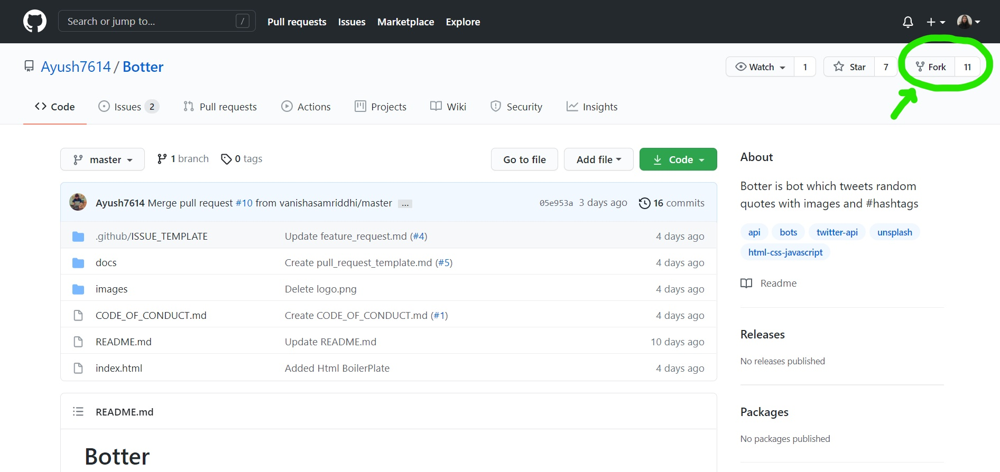

# Contribution Guidelines 🏗
Are we missing any of your favorite features, which you think you can add to it❓ We invite you to contribute to this project and improve it further.

## Code of Conduct
Make sure to read it here: [CODE OF CONDUCT](CODE_OF_CONDUCT.md)

## Preliminaries
- Download and install the latest stable version of  [Git](https://git-scm.com/downloads)  📥  for version control.
- Download and install latest stable version of  [VS Code](https://code.visualstudio.com/download)


To start contributing, follow the below guidelines:

Take a look at the existing [issues](https://github.com/Ayush7614/Botter/issues) or create your own issues. Wait for the Issue to be assigned to you after which you can start working on it.
To start contributing, follow the below guidelines:

## A. Setting up project

**1.** Fork [this](https://github.com/Ayush7614/Botter) repository.

<div align="center"></div>

**2.** Clone your forked copy of the project.
```
git clone --depth 1 https://github.com/<your_user_name>/Botter.git
```
**3.** Navigate to the project directory 📁 
```
cd Botter
```
**4.** Add a reference to the original repository.
```
git remote add upstream https://github.com/Ayush7614/Botter.git
```
**5.** Check the remotes for this repository.
```
git remote -v
```
**6.** Always take a pull from the upstream repository to your master branch to keep it at par with the main project(updated repository).
```
git pull upstream master
```
<br>

- Comment on any existing [issue(s)](https://github.com/Ayush7614/Botter/issues) raised by project maintainers. Otherwise raise a [new issue](https://github.com/Ayush7614/Botter/issues/new/choose).

>### Guidelines for raising a new issue:
>-   Each issue should have an appropriate and short title.
>
>-   Attach a screenshot/clip if applicable.
>  
>-   Please be patient enough. The project maintainers/mentors would review it as per their schedule.
>
>-   Feel free to suggest your opinions on the already raised issues.
>  
>-   All participants are welcomed to suggest new features/bug fixes/improvements and raise new issues for those. However, the assignment would be done once approved by either of the project maintainers or the mentors.

## B. Contributing to the project
-   Once the project maintainer(s)/mentor(s) have reviewed the issue/assigned you the issue. Start working on the changes.

**1.** Create a new branch (DO NOT name it MAIN or MASTER or anything random).
```
git checkout -b <your_branch_name>
```
**2.** Perform your desired changes to the code base.
- Make sure that you do not change any code unrelated to the task that you have been assigned.

- Ensure that your changes apply to all screensizes.

- Comment any new code addition(s).

- Do not mess up the directory structure.

- Preview your changes and test them properly before proceding ahead.

<div align ="center"></div>

- Make a small clip or take screenshots before and after making changes.

**3.** Track your changes✔️.
```
git add .
```
**4.** Commit your changes.
```
git commit -m "Relevant message"
```
**5.** Push the committed changes in your feature branch to your remote repo.
```
git push -u origin <your_branch_name>
```
**6.** To create a pull request, click on `compare and pull requests`.Please ensure you compare your feature branch to the desired branch of the repo you are suppose to make a PR to.

<div align="center"></div>

**7.** Add appropriate title and description to your pull request explaining your changes and efforts done.

**8.** Click on `Create Pull Request`.

<div align="center"></div>

>## Guidelines for raising a pull request:
>-   Each pull request should have an appropriate and short title.
>  
>-   Do not leave the description blank. Make sure you describe your intended changes in the description section of the pull request. (Use bullet points and phrases)
>    
>-   Make sure to refer the respective issue in the respective PR using phrases like  `Resolves #issue_number` ,  `Closes #issue_number` or `Fixes #issue number`. 
>-   Attach a screenshot/clip of the change(s) made.


**9.**  Voila ❗ You have made a PR to the Botter project 💥 . Sit back patiently and relax while the project maintainers review your PR.

<div align ="center"></div>